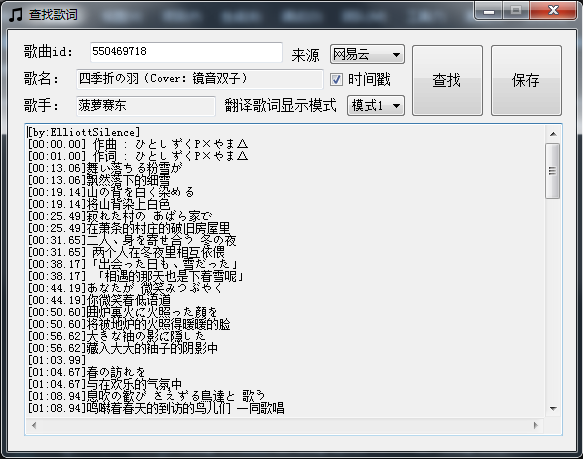

# LyricCapture
LyricCapture是一个下载lrc歌词和试听的小程序，目前支持网易云音乐和QQ音乐

## 下载
* [LyricCapture_v1.0](https://github.com/ElliottSilence/LyricCapture/releases)

## 使用方法
填入对应的歌曲ID即可进行搜索下载。

歌曲ID可以通过歌曲详情页的url来获取，例如：  
http://music.163.com/#/song?id=550469718 ，ID是 550469718  
https://y.qq.com/n/yqq/song/000dMwsh3E6OWe.html ，ID是 000dMwsh3E6OWe



### 选项说明
时间戳：勾选后会在每句歌词前显示lrc时间

翻译歌词显示模式：外语歌曲有翻译歌词时此选项生效

##### 模式1：翻译显示在每行歌词原文下方
```
原文1
翻译1
原文2
翻译2
...
...
```
##### 模式2：翻译和歌词原文在同一行
```
原文1 翻译1
原文2 翻译2
...   ...
```
##### 模式3：整段歌词原文结束后显示整段翻译
```
原文1
原文2
...
翻译1
翻译2
...
```

### 保存歌词和试听
查找到歌词后，可以点击保存来保存文本框中的内容

如果歌曲支持在线试听，可以通过双击歌名来下载试听
